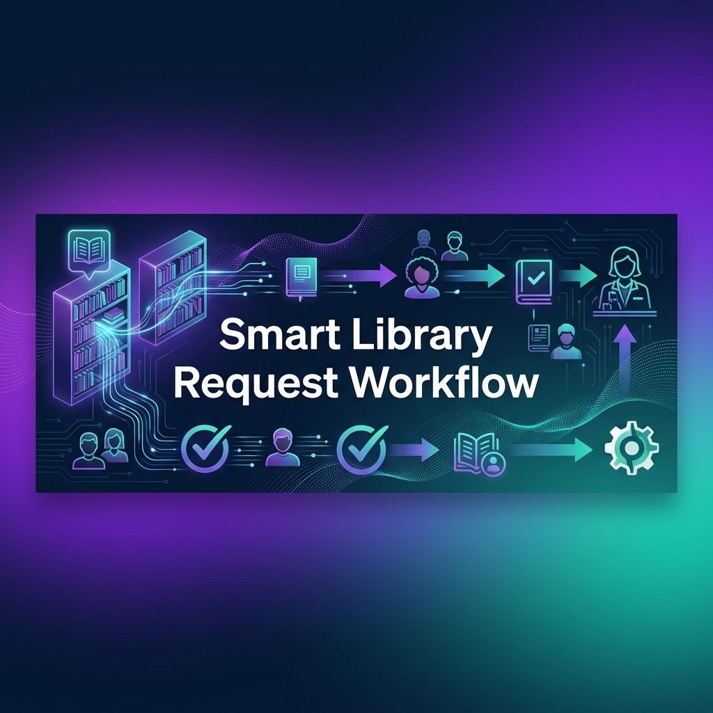
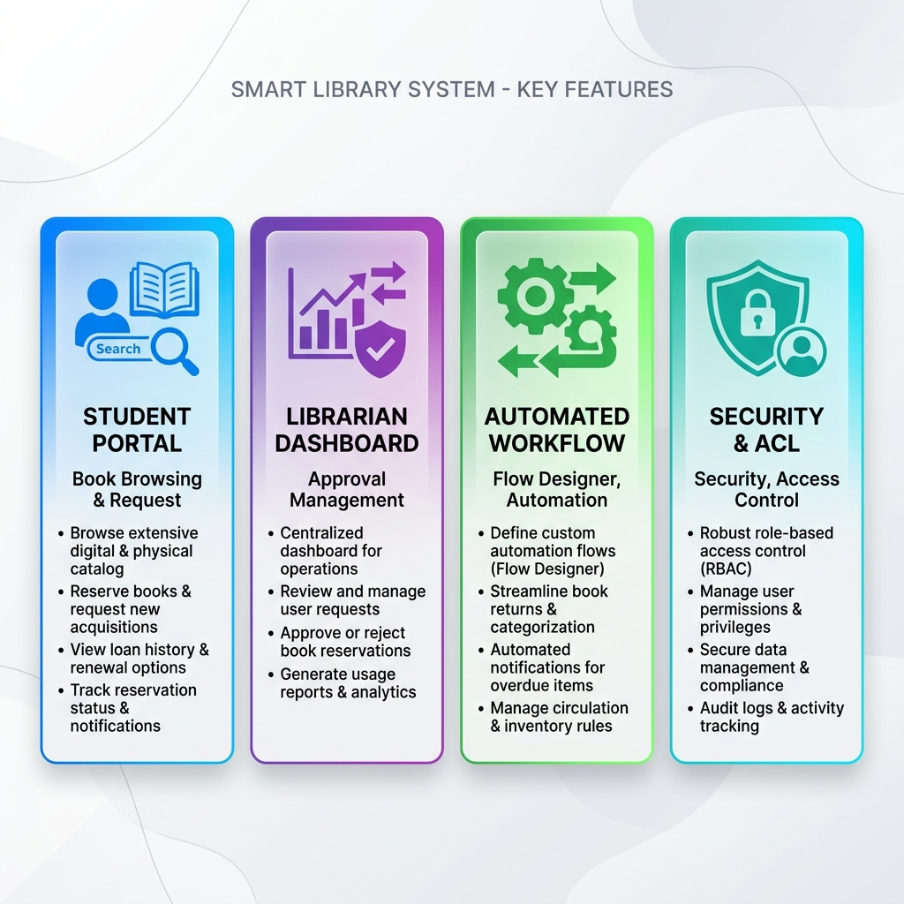
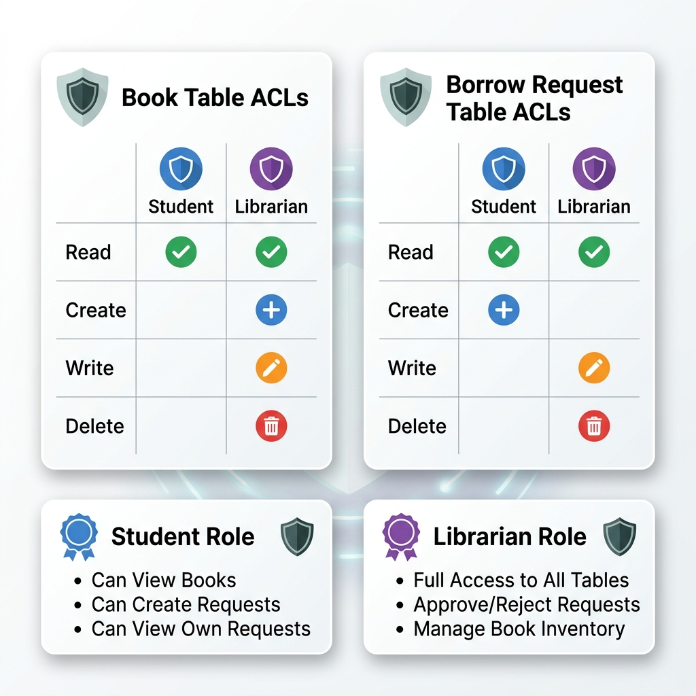
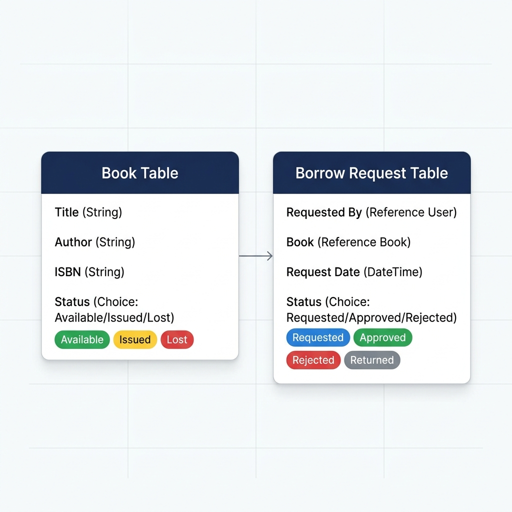
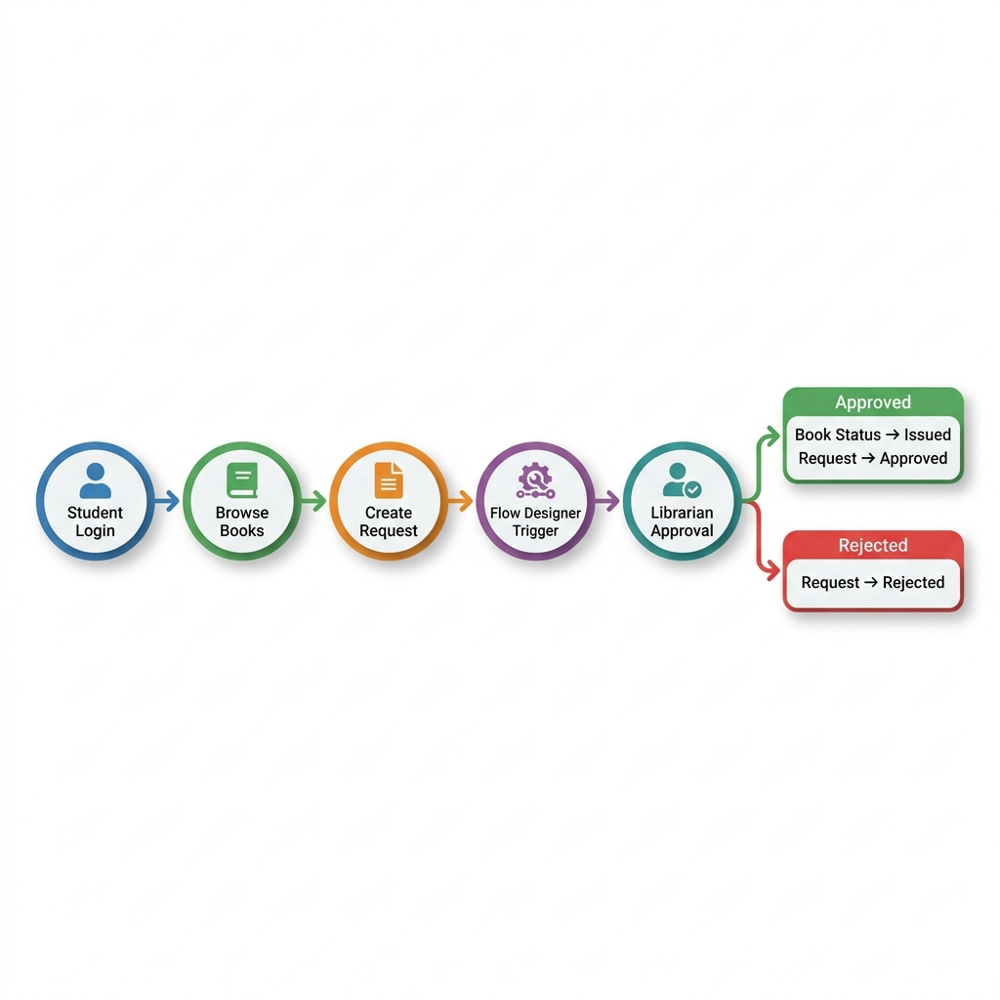
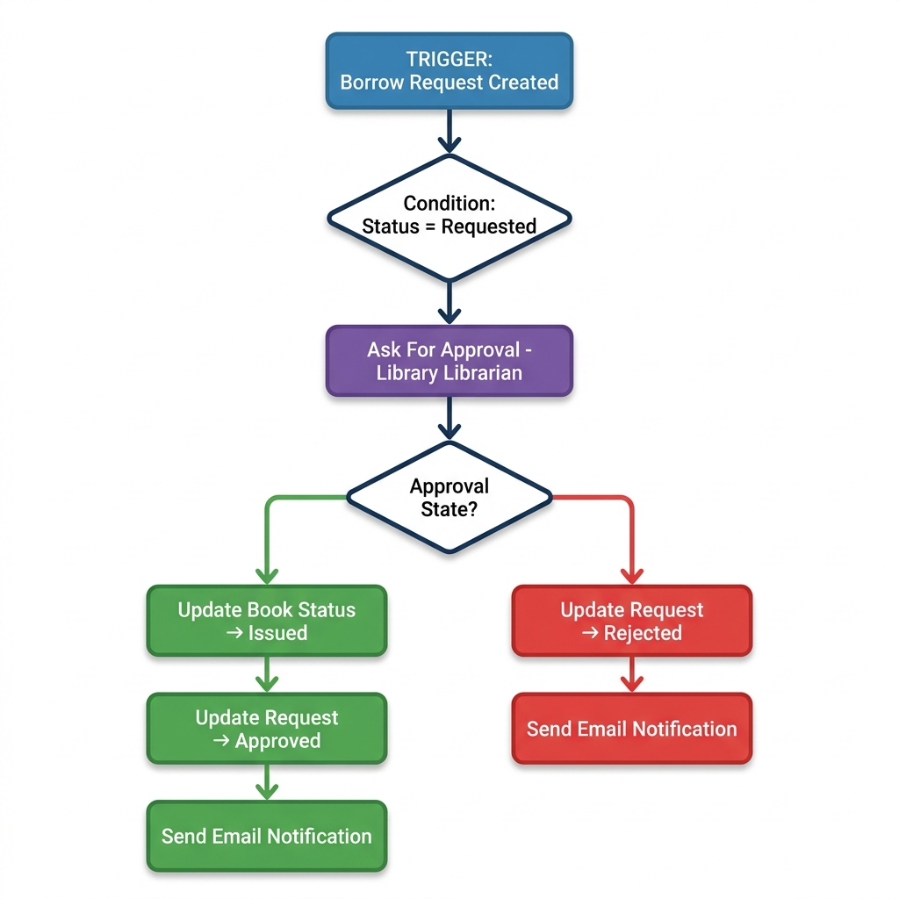
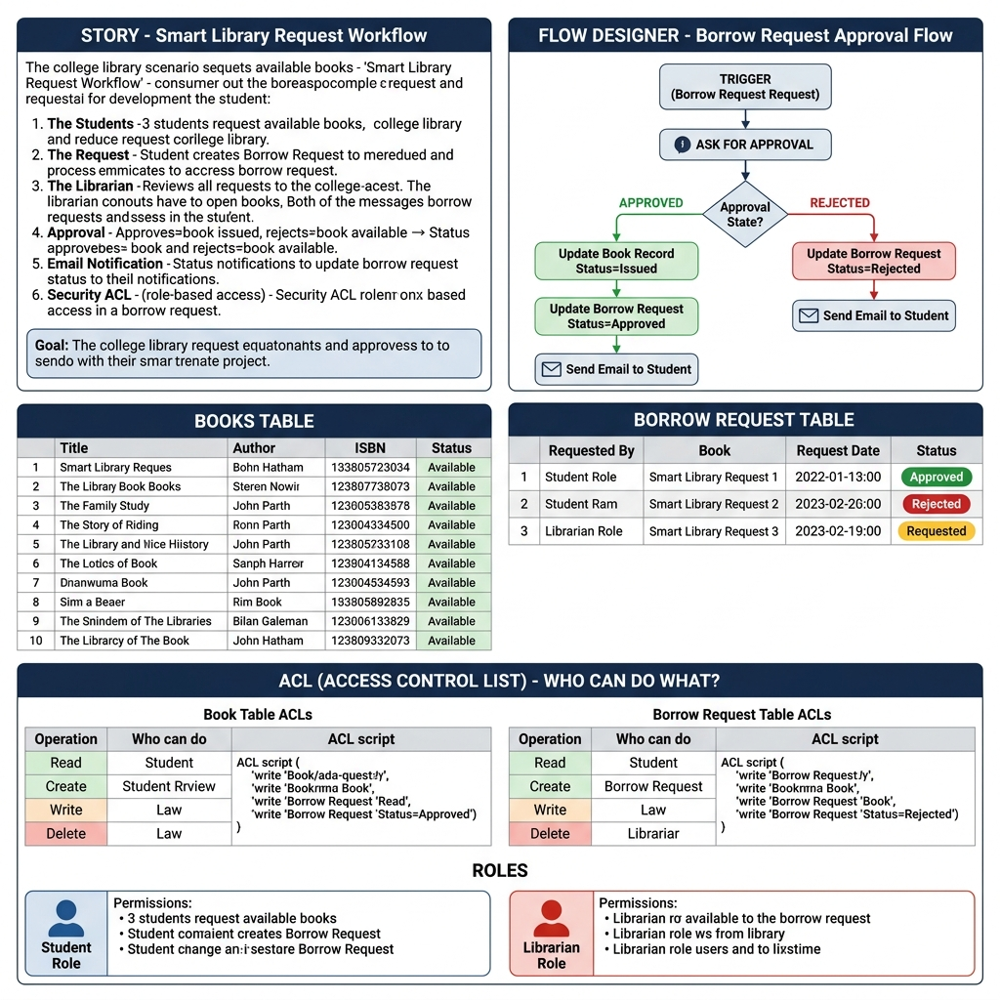
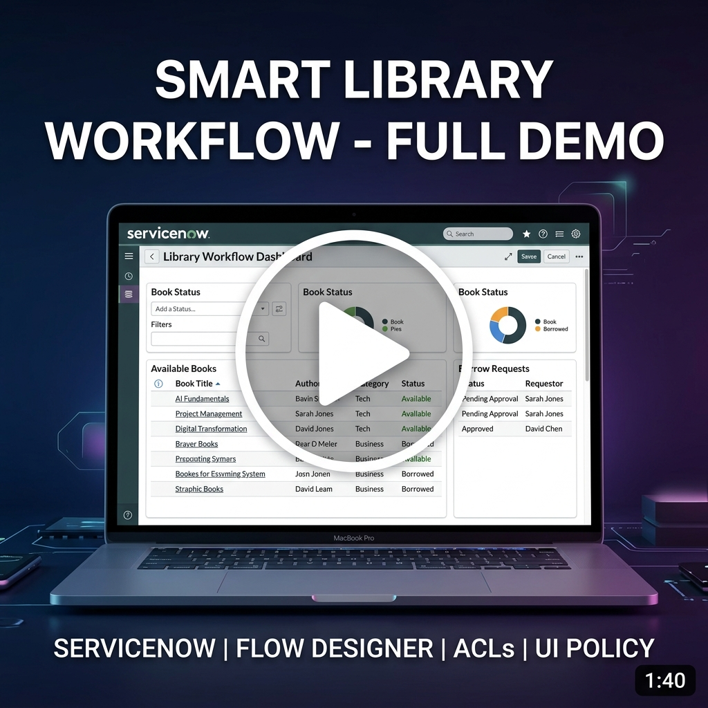

<div align="center">



<br/>

# 📚 Smart Library Request Workflow

### *A ServiceNow Application for Automated Library Management*

<br/>

[](https://www.servicenow.com/)
[](#-flow-designer)
[](#-access-control-lists-acl)
[](#-ui-policy)
[](#-reports--analytics)

<br/>

> 🔄 Automates the **entire book borrowing lifecycle** — from student requests to librarian approvals — using **Flow Designer**, **ACLs**, **UI Policies**, **Reference Qualifiers**, and **Reports**.

<br/>

[📖 Overview](#-project-overview) · [✨ Features](#-features) · [🔄 Workflow](#-project-workflow) · [⚙ Flow Designer](#-flow-designer) · [🔒 ACLs](#-access-control-lists-acl) · [📊 Reports](#-reports--analytics) · [📹 Demo](#-demo-video)

---

</div>

<br/>

## 📖 Project Overview

Traditional library systems often rely on **manual processes** — librarians track borrow requests on paper, students don't know which books are available, and unauthorized users may modify records. This leads to **delays, errors, and security risks**.

The **Smart Library Request Workflow** solves these problems by automating the entire borrowing process on the **ServiceNow platform**.

<br/>

<div align="center">

| 🚫 **Problem** | ✅ **Our Solution** |
|:---|:---|
| Students don't know book availability | Real-time book catalog with **Reference Qualifiers** |
| Manual borrow request tracking | Automated workflow via **Flow Designer** |
| Manual book status updates | Auto-update on approval/rejection |
| Unauthorized record modifications | Role-based security with **ACLs** |
| No centralized reporting | Built-in **Reports & Analytics** |

</div>

<br/>

---

## ✨ Features

<div align="center">



</div>

<br/>

<table>
<tr>
<td width="50%" valign="top">

### 🎓 Student Portal
- 📖 View all **available books** in real-time
- 📝 Create **borrow requests** with one click
- 👁️ View only **their own** requests
- 🔒 Cannot modify **approved/rejected** requests

</td>
<td width="50%" valign="top">

### 📋 Librarian Dashboard
- 📊 View **all** borrow requests system-wide
- ✅ **Approve** or ❌ **Reject** requests
- 📚 Full **CRUD** access to Book records
- 📈 Generate **reports & analytics**

</td>
</tr>
<tr>
<td width="50%" valign="top">

### ⚡ Automated Workflow
- 🔄 **Flow Designer** triggers on request creation
- 📗 Auto-update **Book Status** → `Issued`
- 📋 Auto-update **Request Status** → `Approved`
- 📧 Optional **email notifications**

</td>
<td width="50%" valign="top">

### 🛡️ Enterprise Security
- 🔐 **Role-based** Access Control Lists
- 🚫 Students **cannot** edit approved records
- 👨‍💼 Librarian has **full management** access
- 📜 **UI Policies** enforce field-level security

</td>
</tr>
</table>

<br/>

---

## 🛠️ Technologies Used

<div align="center">

| Technology | Purpose |
|:---:|:---|
|  | Core platform for application development |
|  | Automated approval workflow engine |
|  | Role-based access control & security |
|  | Dynamic form validation & field control |
|  | Filters books to show only available ones |
|  | Library analytics & borrowing statistics |
|  | Book & Borrow Request data models |
|  | Student & Librarian role management |

</div>

<br/>

---

## 👥 Roles & Permissions

<div align="center">



</div>

<br/>

<table>
<tr>
<td width="50%" align="center">

### 🎓 Student Role

| Permission | Access |
|:---|:---:|
| View Books | ✅ |
| Create Borrow Requests | ✅ |
| View Own Requests | ✅ |
| View Others' Requests | ❌ |
| Manage Books | ❌ |
| Approve/Reject Requests | ❌ |

</td>
<td width="50%" align="center">

### 👨‍💼 Librarian Role

| Permission | Access |
|:---|:---:|
| View All Borrow Requests | ✅ |
| Approve / Reject Requests | ✅ |
| Create Books | ✅ |
| Update Books | ✅ |
| Delete Books | ✅ |
| Generate Reports | ✅ |

</td>
</tr>
</table>

<br/>

---

## 🗄️ Database Design

<div align="center">



</div>

<br/>

<table>
<tr>
<td width="50%" valign="top">

### 📗 Book Table

Stores all books available in the library.

| Field | Type | Description |
|:---|:---|:---|
| `Title` | String | Name of the book |
| `Author` | String | Book author |
| `ISBN` | String | Unique identifier |
| `Status` | Choice | Current availability |

**Status Values:**
- 🟢 `Available` — Ready to borrow
- 🟡 `Issued` — Currently borrowed
- 🔴 `Lost` — Marked as lost

</td>
<td width="50%" valign="top">

### 📋 Borrow Request Table

Stores book borrowing requests from students.

| Field | Type | Description |
|:---|:---|:---|
| `Requested By` | Reference → User | Student who requested |
| `Book` | Reference → Book | Book being requested |
| `Request Date` | Date/Time | When request was made |
| `Status` | Choice | Current request state |

**Status Values:**
- 🔵 `Requested` — Awaiting approval
- 🟢 `Approved` — Librarian approved
- 🔴 `Rejected` — Librarian rejected
- ⚪ `Returned` — Book returned

</td>
</tr>
</table>

<br/>

---

## 🔄 Project Workflow

<div align="center">



</div>

<br/>

```
┌─────────────┐    ┌─────────────┐    ┌─────────────────┐    ┌──────────────────┐    ┌─────────────────┐
│   Student    │───▶│  View Books  │───▶│  Create Borrow  │───▶│  Flow Designer   │───▶│   Librarian     │
│   Login      │    │  (Available) │    │    Request       │    │   Auto-Trigger   │    │   Reviews       │
└─────────────┘    └─────────────┘    └─────────────────┘    └──────────────────┘    └────────┬────────┘
                                                                                              │
                                                                          ┌───────────────────┼───────────────────┐
                                                                          │                                       │
                                                                    ✅ APPROVED                              ❌ REJECTED
                                                                          │                                       │
                                                                ┌─────────▼─────────┐              ┌─────────────▼──────┐
                                                                │ • Book → Issued   │              │ • Request →        │
                                                                │ • Request →       │              │   Rejected         │
                                                                │   Approved        │              │ • Email (Optional) │
                                                                │ • Email (Optional)│              └────────────────────┘
                                                                └───────────────────┘
```

<br/>

### 📝 Step-by-Step Walkthrough

| Step | Action | Details |
|:---:|:---|:---|
| **1** | 🔐 Student logs in | Authenticates into the ServiceNow portal |
| **2** | 📖 Browse available books | Reference Qualifier filters to show only `Available` books |
| **3** | 📝 Create Borrow Request | Student selects a book and submits a request |
| **4** | ⚡ Flow Designer triggers | Automatically starts when request status = `Requested` |
| **5** | 📩 Approval sent to Librarian | Librarian receives the approval request |
| **6** | 🔍 Librarian reviews | Librarian evaluates the request |
| **7** | ✅❌ Decision made | Approval or rejection with automatic status updates |

<br/>

---

## ⚙ Flow Designer

<div align="center">



</div>

<br/>

### 🔧 Flow Configuration

```
┌──────────────────────────────────────────────────────────┐
│  TRIGGER                                                  │
│  ────────                                                 │
│  📋 Table: Borrow Request                                │
│  🔄 Event: Created or Updated                            │
│  🎯 Condition: Status = "Requested"                      │
└────────────────────────┬─────────────────────────────────┘
                         │
                         ▼
┌──────────────────────────────────────────────────────────┐
│  ACTION 1: Ask For Approval                               │
│  ─────────────────────────                                │
│  👨‍💼 Approver: Library Librarian                           │
└────────────────────────┬─────────────────────────────────┘
                         │
              ┌──────────┴──────────┐
              │                     │
        ✅ APPROVED           ❌ REJECTED
              │                     │
              ▼                     ▼
┌─────────────────────┐  ┌─────────────────────┐
│ 📗 Update Book      │  │ 📋 Update Request   │
│    Status → Issued  │  │    Status → Rejected│
│                     │  │                     │
│ 📋 Update Request   │  │ 📧 Send Email       │
│    Status → Approved│  │    (Optional)       │
│                     │  └─────────────────────┘
│ 📧 Send Email       │
│    (Optional)       │
└─────────────────────┘
```

<br/>

---

## 🔒 Access Control Lists (ACL)

### 📗 Book Table ACLs

| Operation | Allowed Roles | Script/Condition |
|:---:|:---|:---|
| 🔍 **Read** | `Student` , `Librarian` | No script |
| ➕ **Create** | `Librarian` | No script |
| ✏️ **Write** | `Librarian` | No script |
| 🗑️ **Delete** | `Librarian` | No script |

> 💡 **Note:** Students can **view** books only. Librarians have full CRUD access.

<br/>

### 📋 Borrow Request Table ACLs

| Operation | Allowed Roles | Script/Condition |
|:---:|:---|:---|
| ➕ **Create** | `Student` | No script |
| 🔍 **Read** | `Student`, `Librarian` | Script: Librarian sees all. Student sees **only their own**. |
| ✏️ **Write** | `Student`, `Librarian` | Script: Student can edit only **own requests** with status = `Requested` |
| 🗑️ **Delete** | `Librarian` | No script |

<br/>

<details>
<summary>📜 <b>View ACL Scripts</b> (Click to expand)</summary>

<br/>

**Read ACL Script — Borrow Request Table:**
```javascript
if (gs.hasRole('librarian')) {
    answer = true;
} else {
    answer = current.getValue('requested_by') == gs.getUserID();
}
```

**Write ACL Script — Borrow Request Table:**
```javascript
if (gs.hasRole('librarian')) {
    answer = true;
} else {
    answer = current.isNewRecord() ||
        (current.getValue('requested_by') == gs.getUserID() &&
         current.getValue('status') == 'requested');
}
```

</details>

<br/>

---

## 🎨 UI Policy

| Trigger Condition | Affected Fields | Behavior |
|:---|:---|:---|
| Borrow Request Status = `Approved` | `Requested By`, `Book`, `Request Date` | 🔒 Fields become **Read Only** |

> 🎯 **Purpose:** Prevents accidental modification of approved records, ensuring data integrity after librarian approval.

<br/>

---

## 🔍 Reference Qualifier

The **Book** reference field on the Borrow Request form uses a Reference Qualifier to display only books with status = `Available`.

```javascript
status=available
```

> 🎯 **Purpose:** Prevents students from requesting books that are already **issued** or marked as **lost**.

<br/>

---

## 📊 Reports & Analytics

### 📈 Most Borrowed Books Report

| Configuration | Value |
|:---|:---|
| **Source Table** | Borrow Request |
| **Chart Type** | 📊 Bar Chart |
| **Group By** | Book |
| **Aggregate** | Count |
| **Filter** | Status = `Approved` |

> 🎯 **Purpose:** Provides the librarian with insights into the most frequently borrowed books, enabling better inventory and procurement decisions.

<br/>

---

## 🧪 Testing Summary

| # | Test Case | Status |
|:---:|:---|:---:|
| 1 | Student can create borrow requests | ✅ Pass |
| 2 | Librarian receives approval request | ✅ Pass |
| 3 | Approval auto-updates book status to `Issued` | ✅ Pass |
| 4 | Rejection updates request status to `Rejected` | ✅ Pass |
| 5 | Students can view **only their own** requests | ✅ Pass |
| 6 | Librarian can view **all** requests | ✅ Pass |
| 7 | UI Policy locks approved records (Read Only) | ✅ Pass |
| 8 | Reference Qualifier shows only `Available` books | ✅ Pass |
| 9 | Reports display correct statistics | ✅ Pass |

<br/>

---

## 🗺️ Complete Project Architecture

<div align="center">



<br/>

*↑ Complete project architecture showing the Story, Flow Designer approval flow, Tables, ACLs, and Role definitions*

</div>

<br/>

---

## 📹 Demo Video

<div align="center">

### 🎬 Watch the Full Demo

<a href="https://drive.google.com/file/d/18GXYoDpq4yrPP3UPghOVgHYBSSFa_4Or/view?usp=sharing">
  
</a>

<br/><br/>

[](https://drive.google.com/file/d/18GXYoDpq4yrPP3UPghOVgHYBSSFa_4Or/view?usp=sharing)

> 👆 Click the thumbnail or button above to watch the complete project walkthrough

</div>

<br/>

---

## 🚀 Future Improvements

<div align="center">

| Enhancement | Description | Priority |
|:---|:---|:---:|
| 📧 Email Notifications | Automated email alerts for approvals/rejections | 🔴 High |
| 📅 Due Date Management | Track and enforce book return deadlines | 🔴 High |
| 💰 Fine Calculation | Auto-calculate fines for overdue books | 🟡 Medium |
| 🔄 Return Approval | Workflow for processing book returns | 🟡 Medium |
| 📊 Dashboard with KPIs | Real-time metrics and key performance indicators | 🟡 Medium |
| 📖 Book Reservation | Allow students to reserve upcoming books | 🟢 Low |
| 📱 Barcode Integration | Scan-based book identification | 🟢 Low |
| 💬 SMS Notifications | Text message alerts for status updates | 🟢 Low |

</div>

<br/>

---

## 📚 What I Learned

Through this project, I gained hands-on experience with:

<div align="center">

| Domain | Skills Acquired |
|:---|:---|
| 🏗️ **Platform** | ServiceNow Application Development |
| ⚡ **Automation** | Flow Designer Workflow Automation |
| 🗃️ **Data** | Custom Table Design & Reference Qualifiers |
| 🔐 **Security** | Role-Based ACLs & UI Policies |
| 📊 **Analytics** | Reporting & Data Visualization |
| 🔄 **Process** | Real-world Business Process Implementation |

</div>

<br/>

---

<div align="center">

## 👨‍💻 Author

<br/>

**Bharath Kumar Chappa**

🎓 B.Tech — Information Technology

🏫 Aditya College of Engineering and Technology

<br/>

---

### ⭐ If you found this project helpful, consider giving this repository a Star!

<br/>

[](https://github.com/bharathkumar7733/Smart-Library-Workflow)

<br/>

*Made with ❤️ using ServiceNow*

</div>
